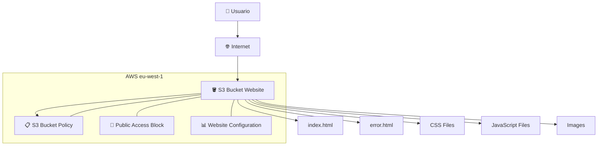

# Práctica final - Migración a la nube: AWS
**XII Edición Bootcamp DevOps & Cloud Computing Full Stack**

**Evaristo García Zambrana | 12 de octubre de 2025**

---

[🔽 Ir directamente a Cómo desplegar s3taticweb 🔽](#-c%C3%B3mo-desplegar-s3taticweb)

## Descripción

*s3taticweb* es un pequeño caso práctico que, a través de Infrastructure as Code (IaC) usando Terraform despliega un sitio web estático en el servicio Amazon S3 del cloud público AWS.

Tiene como fin hacer uso de uno de los servicios de AWS y la configuración de sus componentes a través de Terraform.

## Diagrama



## Requisitos
- Git
- Terraform >=1.0.0
- AWS CLI
- Cuenta en AWS

Ejecutado en Windows 11 con WSL, AWS-Cli v2.31.2, Terraform v1.13.2 y el proveedor hashicorp/aws v6.15.0.

## Estructura del repositorio
```
├── main.tf                   <- Recursos principales de AWS (S3, políticas, configuración web)
├── outputs.tf                <- URLs y datos del despliegue
├── provider.tf               <- Configuración del proveedor AWS y versiones
├── s3taticweb                <- Contenido del sitio web estático
│   ├── assets                <- Recursos del sitio (estilos, scripts, fuentes)
│   │   ├── css               <- Directorio con hojas de estilo CSS
│   │   ├── js                <- Directorio con scripts JavaScript
│   │   └── webfonts          <- Directorio con fuentes tipográficas
│   ├── error.html            <- Página de error 404
│   ├── images                <- Directorio con imágenes
│   │   ├── error.jpg         <- Imagen para página de error
│   │   └── index.jpg         <- Imagen principal del sitio web
│   └── index.html            <- Página principal del sitio web
├── terraform.tfvars_example  <- Ejemplo de variables personalizables
├── upload_files.tf           <- Recursos para subir archivos al bucket S3
└── variables.tf              <- Definición de variables de entrada
```


## 🚀 Cómo desplegar s3taticweb

### 1. Clona el repositorio de GitHub
```
git clone https://github.com/KeepCodingCloudDevops12/EvaristoGZ_04-AWS
```

### 2. Ubícate en el directorio Git
```
cd EvaristoGZ_04-AWS
```

### 3. Configura las credenciales de AWS
Vincula tu AWS CLI con tu cuenta de usuario de AWS ejecutando:

```
aws configure
```

[Más información sobre cómo configurar las crendenciales AWS.](#configuraci%C3%B3n-de-aws-cli)


### 4. Personalizar variables (opcional)
El código ya incluye configuraciones a través de variables por defecto, pero, si deseas personalizar las variables puedes hacerlo personalizando el fichero *.tfvars* o en la misma ejecución del comando.

#### 4.1 Personalizando el fichero .tfvars
Esta es la opción más recomendable, ya que los cambios quedan reflejados en un fichero y no en la ejecución de un comando.
```
cp terraform.tfvars_example terraform.tfvars
```

Luego, edita el fichero personalizando lo que desees.

#### 4.2 Sobrescribiendo las variables
También puedes personalizar las variables en la ejecución con el parámetro *-var="key=value"*.

Por ejemplo: `terraform apply -var 'bucket_name=nombre-unico-para-bucket'`

❗Importante: Si usas cualquier personalización mediante esta técnica, deberás conservarlo a la hora de hacer nuevos deploys o un destroy.

### 5. Prepara el entorno
Estando en el directorio del repositorio Git, configura el backend, descarga providers, plugins y módulos con la ejecución del siguiente comando:

```
terraform init
```

### 6. Verifica el despliegue (opcional)
Previsualiza y comprende el despliegue.

`terraform plan` o `terraform plan -var 'aws_region=eu-south-2'` si quisieras personalizar una variable.

### 7. Despliega la infraestructura
Ejecuta la creación de la infraestructura en AWS.

```
terraform apply
```

Cuando se pida, teclea *Yes* para continuar con el despliegue.

La salida será algo similar a `Apply complete! Resources: 32 added, 0 changed, 0 destroyed.` junto a los outputs.

### 8. Accede a través del navegador web
Accede a la dirección URL que se te ha proporcionado por la salida de consola.

Si dejaste todo los valores por defecto, ha de ser: [http://s3taticweb.s3-website-eu-west-1.amazonaws.com](http://s3taticweb.s3-website-eu-west-1.amazonaws.com)

### 9. Testea y haz cambios
- Accede a un path erróneo para que se muestre el HTML *error.html*, por ejemplo, [http://s3taticweb.s3-website-eu-west-1.amazonaws.com/test](http://s3taticweb.s3-website-eu-west-1.amazonaws.com/test)
- Verifica los recursos y configuraciones creadas a través de la consola web de AWS o a través de AWS CLI
- Genera cambios locales en el directorio *s3taticweb* y vuelve a aplicar la configuración con `terraform apply`.

### 9. Elimina la infraestructura
Por último, elimina la infraestructura para evitar cualquier coste.

*-auto-approve* no pedirá confirmación

```
terraform destroy -auto-approve
```

La salida deberá ser algo similar a `Destroy complete! Resources: 32 destroyed.`

❗Recuerda: Si usas cualquier personalización de variables, deberás indicar esa misma personalización a la hora de hacer *destroy*.

---

## Componentes

| Recurso | Descripción | Propósito |
|---------|-------------|-----------|
| aws_s3_bucket | Bucket principal de S3 | Almacenar archivos del sitio web |
| aws_s3_bucket_website_configuration | Configuración de website | Habilitar hosting estático |
| aws_s3_bucket_public_access_block | Control de acceso público | Permitir acceso público al contenido |
| aws_s3_bucket_policy | Política del bucket | Definir permisos de lectura pública |
| aws_s3_object | Objetos individuales | Archivos HTML, CSS, JS, imágenes, fonts |


## Tabla de variables personalizables

Este proyecto utiliza variables de Terraform que puedes personalizar según tus necesidades. Todas las variables tienen valores por defecto, por lo que el despliegue funciona sin configuración adicional.

Puedes personalizar las variables a través de un fichero terraform.tfvars o a través de un parámetro del tipo *-var="key=value"* en la ejecución del comando de Terraform.

| Variable | Descripción | Valor por defecto | Ejemplos |
|----------|-------------|-------------------|---------|
| `aws_region` | Región de AWS donde se desplegará la infraestructura | `eu-west-1` | `us-east-1`, `eu-central-1` |
| `project_name` | Nombre del proyecto para etiquetado y organización | `KeepCoding`  | `AplicacionWeb`, `WebsiteEGZ` |
| `environment` | Entorno de despliegue para separar dev/prod | `dev` | `prod`, `staging`, `test` |
| `bucket_name` | Nombre único del bucket S3 (debe ser globalmente único) | `s3taticweb` | `web-estatica-kc-2025`, `bucker-para-web-2025` |

## Configuración de AWS CLI

### Instalación de AWS CLI
Para la instalación de AWS-CLI puedes dirigirte a la [documentación oficial](https://docs.aws.amazon.com/cli/latest/userguide/getting-started-install.html).

### Verificación de versión y usuarios
Si ya tenías instalado AWS-CLI, puedes verificar la versión con `aws --version`

También puedes listar los usuarios IAM asociados a tu CLI con la ejecución de `aws iam list-users`

El usuario deberá contar con permisos para administrar buckets de Amazon S3 y su contenido.

### Configurar un nuevo usuario
Accede a "My security credentials" en tu consola web de AWS.

Desde allí, podrás crear, ver y eliminar las credenciales para los siguientes métodos o pasos.

#### Método 1: Mediante AWS CLI
Ejecuta en la terminal `aws configure` y completa los campos AWS
*AWS Access Key ID*, *Secret Access Key*, *Default region name* y *Default output format*

#### Método 2: Mediante variables de entorno en Linux
Exporta las variables de entorno en tu sistema Linux:
```
export AWS_ACCESS_KEY_ID="tu-access-key"
export AWS_SECRET_ACCESS_KEY="tu-secret-key"
export AWS_DEFAULT_REGION="eu-west-1"
```

## Comandos principales

```bash
# Inicializar proyecto
terraform init

# Planificar cambios
terraform plan

# Aplicar cambios
terraform apply

# Ver outputs
terraform output

# Destruir infraestructura
terraform destroy

# Ver resumen completo del despliegue
terraform output deployment_summary
```

---

## Errores comunes

### Terraform initialized in an empty directory!
Si tras ejecutar `terraform init` te aparece este mensaje, seguramente no te encuentres en el directorio correcto.

Navega hasta el directorio del repositorio git y vuelve a ejecutar el comando.

### Error: "BucketAlreadyExists"
Si a la hora de realizar un `terraform apply` obtienes este error, significa que el bucket ya existe mundialmente.

Cambia el nombre del bucket (preferiblemente a través del fichero *.tfvars*) por un nombre único mundialmente y vuelve a ejecutar el proceso.

### Error: "BucketAlreadyOwnedByYou"
Si a la hora de realizar un `terraform apply` obtienes este error, significa que ya tienes un bucket con ese nombre del que tú eres propietario.

Ejecuta `aws s3 ls` para verlo.

Si se trata de contenido de prueba, puedes borrar el bucket a través de la consola web o con AWS CLI: `aws s3 rb s3://nombre-del-bucket --force`

### Error: 404 Not Found Code: NoSuchBucket
```
404 Not Found
Code: NoSuchBucket
Message: The specified bucket does not exist
BucketName: s3taticweb
```

Si te aparece este error, el mensaje es claro: no existe el bucket. Bien porque aún no se ha creado (puede estar en proceso), porque se ha eliminado o porque el nombre que has introducido no es el correcto. Verifica el nombre y vuelve a intentarlo.